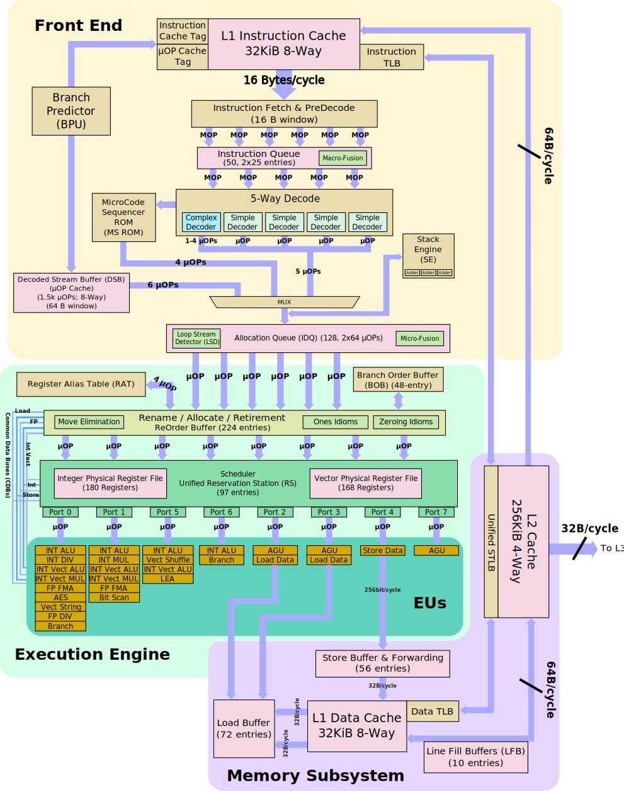

# Introduction
This project helps to explore your hardware and achieve the peak performance for your needs.

# Enviroment
* OS: ubuntu 20.04
* Compiler: GCC 9.3.0
* Platform: x86_x64
* Hardware info:
```
Architecture:                    x86_64
CPU op-mode(s):                  32-bit, 64-bit
Byte Order:                      Little Endian
Address sizes:                   39 bits physical, 48 bits virtual
CPU(s):                          6
On-line CPU(s) list:             0-5
Thread(s) per core:              1
Core(s) per socket:              6
Socket(s):                       1
Vendor ID:                       GenuineIntel
CPU family:                      6
Model:                           158
Model name:                      Intel(R) Core(TM) i5-8400 CPU @ 2.80GHz
Stepping:                        10
CPU MHz:                         2808.010
BogoMIPS:                        5616.02
Hypervisor vendor:               Microsoft
Virtualization type:             full
L1d cache:                       192 KiB
L1i cache:                       192 KiB
L2 cache:                        1.5 MiB
L3 cache:                        9 MiB
Vulnerability Itlb multihit:     KVM: Vulnerable
Vulnerability L1tf:              Mitigation; PTE Inversion
Vulnerability Mds:               Mitigation; Clear CPU buffers; SMT Host state unknown
Vulnerability Meltdown:          Mitigation; PTI
Vulnerability Spec store bypass: Mitigation; Speculative Store Bypass disabled via prctl and seccomp
Vulnerability Spectre v1:        Mitigation; usercopy/swapgs barriers and __user pointer sanitization
Vulnerability Spectre v2:        Mitigation; Full generic retpoline, IBPB conditional, IBRS_FW, STIBP disabled, RSB filling
Vulnerability Srbds:             Unknown: Dependent on hypervisor status
Vulnerability Tsx async abort:   Not affected
Flags:                           fpu vme de pse tsc msr pae mce cx8 apic sep mtrr pge mca cmov pat pse36 clflush mmx fxsr sse sse2 ss ht syscall nx pdpe1gb rdtscp lm constant_tsc rep_good nopl xt
                                 opology cpuid pni pclmulqdq ssse3 fma cx16 pcid sse4_1 sse4_2 movbe popcnt aes xsave avx f16c rdrand hypervisor lahf_lm abm 3dnowprefetch invpcid_single pti ssbd
                                 ibrs ibpb stibp fsgsbase bmi1 avx2 smep bmi2 erms invpcid rdseed adx smap clflushopt xsaveopt xsavec xgetbv1 xsaves md_clear flush_l1d arch_capabilities
```
* Miroarch: Coffee Lake (AVX2)


# Theorical Peak Performance

Coffee Lake microarch has two issue ports each has a `FMA` unit(see the previous diagram), so at most two floating point instructions(`add` and `mul`) could be done per-cycle, in addition the CPU supports `avx2` extension with 256bit register which could hold 4 FP64(8 FP32) values, as a result 16 FP64 instructions could be executed per-cycle. The CPU could boost it's frequency from 2.8GHz to at most 4GHz, so the peak performance could be 64GFLOPS(FP64).

Also the following formula could be used:

```
N_CORES * FREQUENCY * FMA * UNITS * (SIZE_OF_VECTOR/64)
```

for my hardware in single thread

```
1 * 4 * 2 * 2 * (256/64) = 64
```

# Benchmarks

## Single Thread
|Method|GFLOPS(FP64)|
| :---: | :---: |
| Theory|64|
| MKL |56.971941|
|OpenBlas|51.170771|
|naive-ijk|1.960400|
|manual|2.071832|
